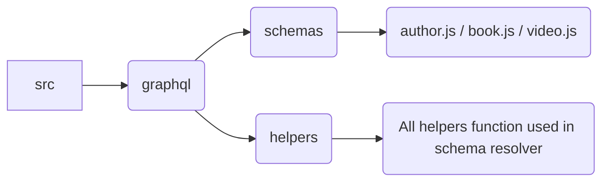

# Test konbini

Install dependencies: `npm install` 

To start the server : `nodemon` or `npm start`

To test graphql queries go to: http://localhost:3000/graphql

Organization of folders:

```mermaid
graph LR
A[src] --> B(graphql)
B --> C(schemas)
B --> D(helpers)
C --> E(author.js / book.js / video.js)
D --> F(All helpers function used in schema resolver)
```